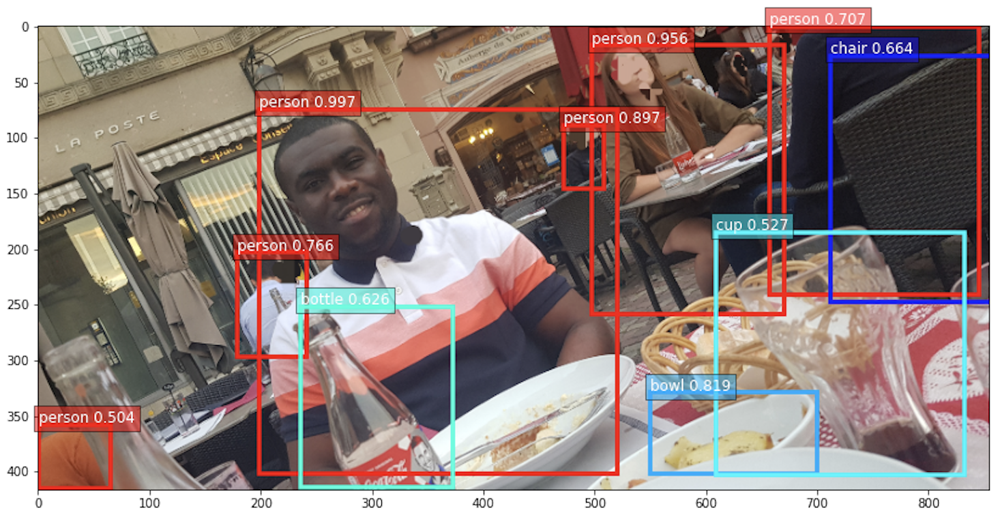

\
*Personal photo by agougoua (**Tous droits réservés ®**)*
# Détection d'objets avec la librairie GluonCV
Ce repository est lié à notre article [Détection D'Objets Avec La Librairie GluonCV](https://ledatascientist.com/detection-dobjets-avec-la-librairie-gluoncv/).

## Aperçu de l'article
Le *Deep Learning* a permis une avancée notable dans plusieurs domaines de recherche dont le *Computer Vision* (Vision par Ordinateur *in french* 😄). Dans cet article, je vous présente l’une des applications du Computer Vision : **la détection d’objets avec la librairie Python GluonCV**.
